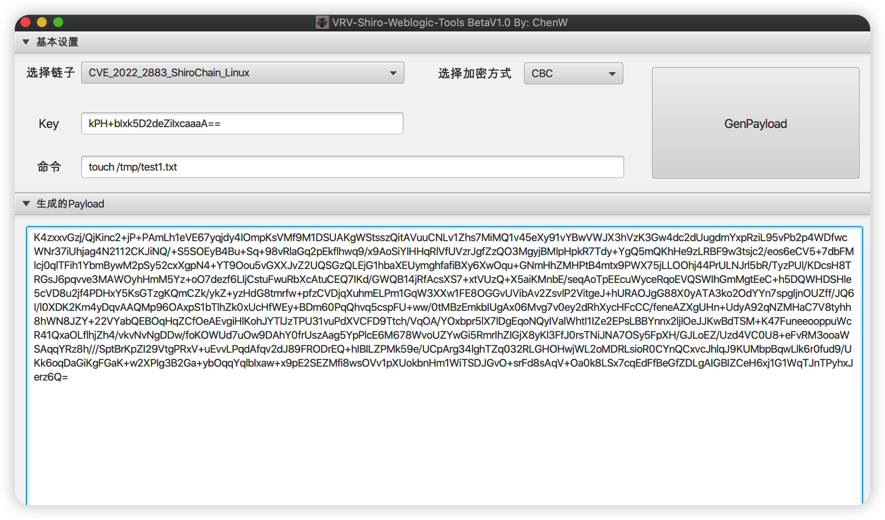
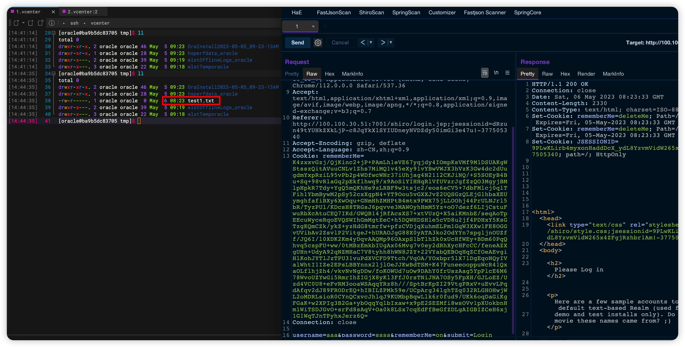

# VRV Shiro_Weblogic_Tool
### 针对部署在Weblogic上的shiro漏洞

### 简介
日常项目中，可能会碰见部署在weblogic上的shiro，所以先写了这个生成攻击payload的小Demo，方便后面使用。

### 免责声明
本工具仅能在取得足够合法授权的企业安全建设中使用，在使用本工具过程中，您应确保自己所有行为符合当地的法律法规。 如您在使用本工具的过程中存在任何非法行为，您将自行承担所有后果，本工具所有开发者和所有贡献者不承担任何法律及连带责任。 除非您已充分阅读、完全理解并接受本协议所有条款，否则，请您不要安装并使用本工具。 您的使用行为或者您以其他任何明示或者默示方式表示接受本协议的，即视为您已阅读并同意本协议的约束。

### 利用支持

```bash
   「*」CVE_2022_2883_ShiroChain_Linux
   「*」CVE_2022_2883_ShiroChain_Win
   「*」CVE_2022_2555_ShiroChain_ALL
```
目前今天只写无回显命令执行，后续回显、内存马功能后面出差后再写。

### 环境搭建
参考ABC123大佬的公众号文章

### 利用演示
先生成payload：

放到burp进行发包：


### 工具启动方式
```bash
java -javaagent:VRV-Tools.jar -jar VRV-Tools.jar
```
密码是：`VRV`
